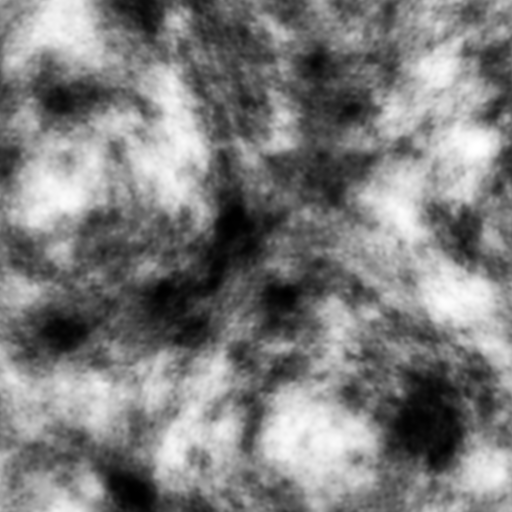
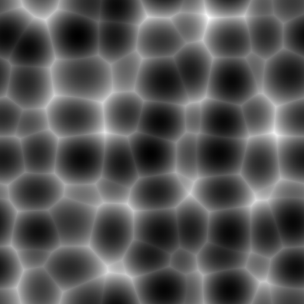
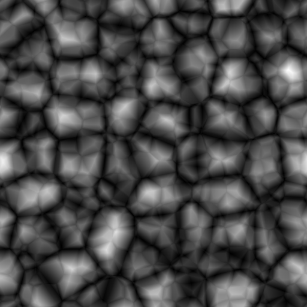
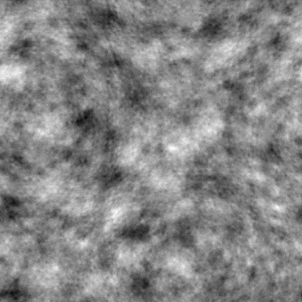
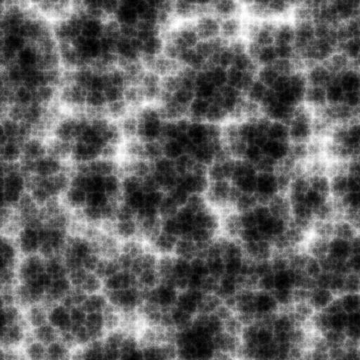
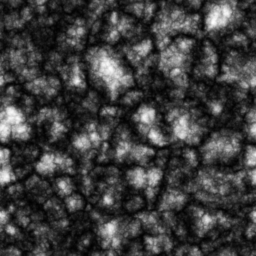

# noisegen

  

  

This is an app to generate and save noise textures for use in game development and graphics programming, with lots of settings. There are a couple of these generators online that I've seen, but none that generated seamless noise that cycles on itself in all directions, which is very important for making shaders. Any technical artist knows that noise is used everywhere in all sorts of effects, and most times sampling from a texture is more efficient than generating it but in order to do that you need the textures to be seamless. The Godot engine has an internal noise texture generator and they can make them seamless, but if you're anywhere else you're out of luck. Well, no longer!

This project is a port of my [Unity Support Textures Generator](https://github.com/eldskald/unity-support-textures-generators) project. This one doesn't run inside Unity, you can use it on its [itch.io page](https://eldskald.itch.io/noisegen) or download the self contained executable and run on Windows or Linux.

## Installing

You can download or you use the app in your browser at [eldskald.itch.io/noisegen](https://eldskald.itch.io/noisegen). Just unzip and run, it's just a self contained executable.

## Building

It's just C and glsl with [raylib](https://github.com/raysan5/raylib) and [raygui](https://github.com/raysan5/raygui), as well as [emsdk](https://emscripten.org/docs/getting_started/downloads.html) to compile to WebGL and [MinGW](https://www.mingw-w64.org/) to compile to Windows, so you might need those. This was built with emsdk 4.0.10 specifically, so if it breaks you can try to build with this version.

It's also using [clang-format](https://clang.llvm.org/docs/ClangFormat.html) to format the code, as well as [clang-tidy](https://clang.llvm.org/extra/clang-tidy/) to lint.

Clone the project and setup a `.env` file by copying [.env.example](.env.example) and changing some of its settings if you need to. Default values are for Linux. I recommend WSL if you're working on Windows.

Then, run the following to install dependencies:

```console
bin/install-dependencies
```

Having done both things, run the following to build it:

```console
make linux   # Makes a Linux build
make windows # Makes a Windows build
make webgl   # Makes a WebGL (HTML5) build
make         # All of the above
```

## Developing

If you want to mess around the source files, you can run `bin/dev` to quickly build and run and then delete the build when you close it. You can also run `bin/web-dev` to build for WebGL and serve the files for you to access it on `localhost:3000` or whatever port you set on your `.env` file.

To format and lint the whole project, run the following binaries. Take into account you need `clang-tidy` and `clang-format`.

```console
bin/format
bin/lint
```

## Working with a web build

To make a web build, you will need to have [emsdk](https://emscripten.org/docs/getting_started/downloads.html) version 4.0.10 and `python`. Follow the link on how to install it in this version. Then, update you `.env` file with the directory you installed `emsdk` in.

If you can't compile either `raylib` or the game, pay attention to the error messages, might be some of these binaries that can't be found. Something might not be on your `PATH` or you did not set your `.env` correctly.

## Credits

The noise gen shaders were done by [Hugh Kennedy](https://github.com/hughsk/glsl-noise) and [Justin](https://github.com/Scrawk/GPU-Voronoi-Noise), I only added FBM, power, range, seamless and the other settings. Thank them very much for their work!

## License

This is an unlicensed project, meaning you can do whatever you want with it.

For more information, please refer to <https://unlicense.org>
